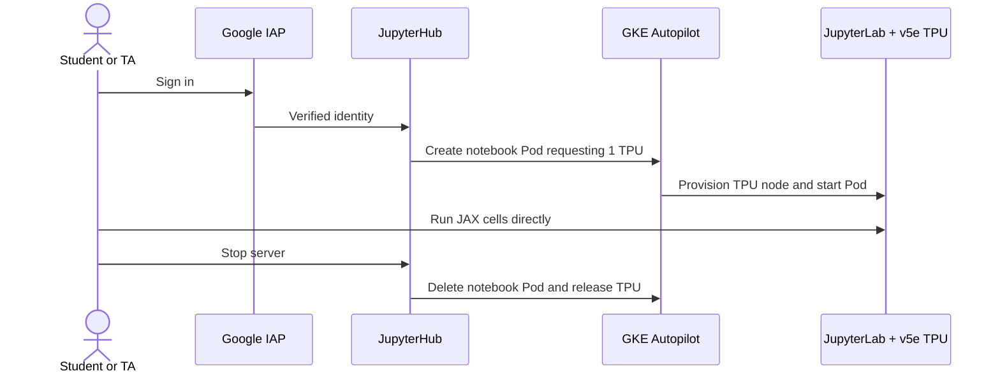

# Direct TPU notebook architecture

LLM Systems uses a single JupyterHub profile for both students and TAs. Google Identity-Aware Proxy (IAP) admits the configured course groups. JupyterHub creates one JupyterLab Pod per user; that Pod directly requests one v5e TPU chip with the `1x1` topology. The user's 32 GiB home PVC persists when the Pod stops.

## Access and isolation

- IAP IAM bindings in `scripts/08_setup_iap.sh` grant the student and TA groups access to the same Hub. The single notebook profile has no group restriction. `ADMIN_USERS` separately controls JupyterHub administration.
- Notebook Pods use GKE Sandbox (`runtimeClassName: gvisor`) and the JupyterHub NetworkPolicy. Private cluster addresses and the cloud metadata server stay blocked.
- Notebook Pods do not receive Job submission RBAC or a mounted Kubernetes API token. JAX executes inside the notebook Pod on its attached TPU.
- The namespace ResourceQuota caps simultaneous TPU requests through `requests.google.com/tpu`. This is a hard limit, not a queue. Regional quota and available physical capacity are also required.

## Lifetime and costs

A chip is allocated while its notebook Pod exists, including idle periods. JupyterHub culls idle servers after 30 minutes and all servers after eight hours. A stopped server releases its TPU; the home PVC remains. The ResourceQuota and idle culler are the main capacity and cost controls.

The earlier Kueue and `submit_tpu.py` batch prototype remains in the repository for development. It is not installed by `make cluster`, mounted into notebook Pods, or used by the current starter notebook.
